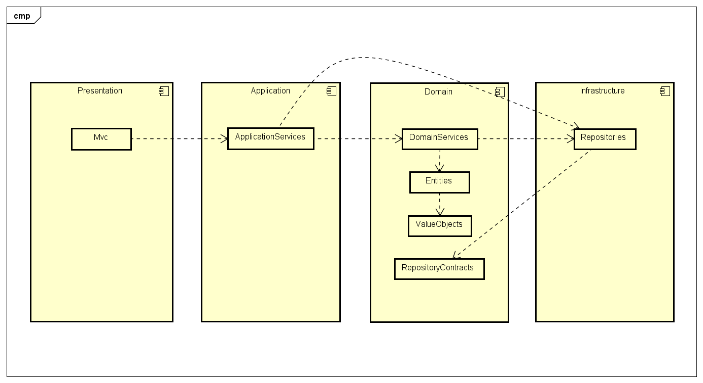

# Tech Test Tennis

## Desafio
Neste problema você deverá implementar as regras de um jogo de tênis simples (apenas dois jogadores).

As regras de um jogo de tênis tem diversos detalhes, mas para simplificar o problema, você deve implementar apenas as regras de um game:

- Em um game cada jogador pode ter a seguinte pontuação: 0, 15, 30, ou 40.
- Os jogadores sempre começam com 0 pontos.
- Se o jogador possui 40 pontos e ganha a disputa, ele vence o game.
- Se ambos jogadores atingem 40 pontos, ocorre um empate (deuce).
- Estando em empate, o jogador que ganhar a bola seguinte está em vantagem (advantage).
- Se um jogador em vantagem ganha novamente a bola, ele vence o game.
- Se um jogador estiver em vantagem e o outro ganhar a bola, volta a ocorrer o empta (deuce).


Caso tenha tempo e vontade de melhorar o seu código, você pode implementar mais regras do tênis (serviço, sets, tie-break, etc). Mais informações sobre as regras em http://pt.wikipedia.org/wiki/T%C3%A9nis

## Diagrama de Componentes



## Execução do projeto

```sh
dotnet run -p 1-Presentation
```

## Acesso
https://localhost:5001/
